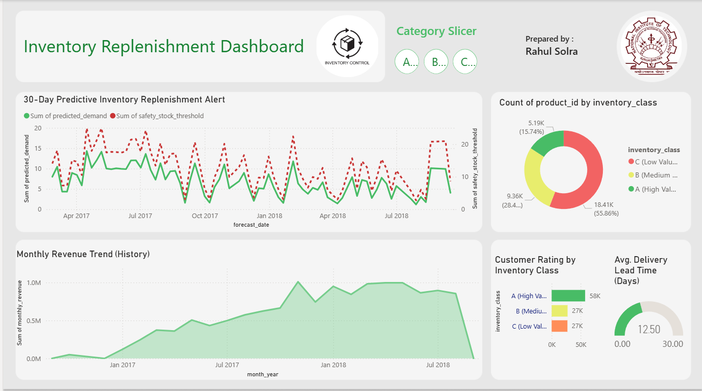

# 📊 AI-Driven Inventory Optimization & Demand Forecast Dashboard
### *End-to-End Supply Chain Analytics Project | SQL • Python (Prophet) • Power BI*

---

## 📂 Project Overview

**Project Title**: Olist E-Commerce Inventory Optimization
**Tools Used**: MySQL, Python (Jupyter Notebook), Power BI Desktop, FB Prophet

### 📝 Description
This project addresses a critical real-world business challenge: **"How to eliminate stock-outs and minimize overstocking costs?"** Using the Olist E-commerce dataset, I engineered an automated decision-support system that prioritizes products using **ABC Analysis**, predicts future demand via **AI-based Time-Series Forecasting**, and monitors warehouse efficiency through **Logistics Lead Time Analysis**.

---

## 🎯 Key Business Questions Answered
The dashboard is strategically architected to provide data-driven answers to these core queries:
* Which are the **Top 15% Products (Class A)** contributing to 70% of the total revenue?
* What is the 30-day demand outlook, and where should the **Safety Stock Floor** be established?
* Which specific product categories face the highest **Stock-out Risk**?
* Is our **Delivery Lead Time** (12.5 days) meeting the organizational efficiency benchmarks?
* What is the correlation between customer engagement (reviews) and sales velocity?

---

## 🚀 Tech Stack Details
* **MySQL**: Performed extensive data engineering, complex joins, and window functions to build **ABC Classification Views**.
* **Python (Prophet)**: Developed a predictive time-series model to account for demand surges and seasonality (Holidays/Weekends).
* **Power BI**: Architected a **Star Schema Data Model** to drive high-performance interactive visualizations.
* **DAX**: Engineered custom measures for Dynamic KPIs, growth percentages, and safety thresholds.

---

## 📈 Key Performance Indicators (KPIs)
The dashboard highlights the following high-stake performance metrics:
* **Total Historical Revenue**: $10.8M+ 
* **Average Delivery Lead Time**: 12.5 Days (Benchmark: 10 Days)
* **Class A Contribution**: 70% of Revenue from 15% SKUs
* **AI Forecast Precision**: Integrated high-confidence intervals for demand replenishment.

---

## 📊 Walkthrough of Key Visuals

### 🔹 1. AI Demand Forecast vs. Safety Threshold (Line Chart)
* **Insight**: Compares Predicted Demand (Blue Line) against the Safety Stock Limit (Red Dashed Line).
* **Actionable**: When the prediction nears the threshold, it serves as an automated **"Replenishment Alert"** for warehouse managers.

### 🔹 2. Inventory Distribution (Donut Chart)
* **Insight**: Categorizes the product portfolio into 'A', 'B', and 'C' classes based on financial impact.
* **Actionable**: Facilitates **Tight Inventory Control** for Class A items and Lean Management for Class C items.

### 🔹 3. Avg. Delivery Lead Time (Gauge Chart)
* **Insight**: Monitors the end-to-end duration from order inception to customer delivery.
* **Actionable**: Identifies a **25% efficiency gap** (Actual 12.5 vs Target 10), highlighting the need for logistics process re-engineering.

### 🔹 4. Monthly Revenue Trend (Area Chart)
* **Insight**: Visualizes historical revenue volume and seasonal growth patterns.
* **Actionable**: Enables proactive workforce and space planning for peak Q4 sales periods.

---

## 💡 Business Impact & Insights
1. **Strategic Prioritization**: 15% of SKUs drive 70% of revenue; ensuring **Zero Stock-outs** for these items is critical for revenue protection.
2. **Quality Correlation**: High-value (Class A) products receive the highest feedback volume, making them the primary drivers of brand reputation.
3. **Logistics Bottlenecks**: Peak demand periods show increased lead times, indicating a need for scalable logistics infrastructure.

---

## 🏗️ Project Architecture
1. **Data Engineering**: Processed raw transactional data within **MySQL** to calculate ABC logic and logistics speed.
2. **AI Modeling**: Utilized **Python (Prophet)** to generate a 30-day predictive demand outlook.
3. **Intelligence Layer**: Deployed an interactive **Power BI** dashboard with granular slicers for category-level deep dives.

---

## 👨‍🎓 Developed By
**[Rahul Solra]**
